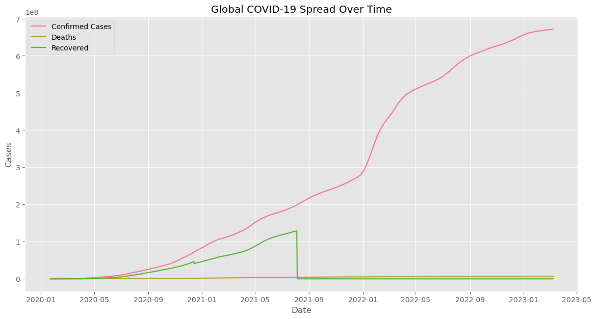

# COVID-19 Global Data Tracker

[](https://www.python.org/)
[](https://opensource.org/licenses/MIT)



A comprehensive data analysis pipeline tracking the global spread of COVID-19. This project provides automated data processing, interactive visualizations, and insights into pandemic trends.

## Features

- **Automated Data Pipeline**: Daily updates from Johns Hopkins University
- **Interactive Visualizations**:
  - Global spread trends
  - Country-specific analysis
  - Mortality rate comparisons
- **Time Series Analysis**: Track progression in selected countries
- **Data Processing**: Clean, merge, and transform raw datasets
- **Reproducible Analysis**: Jupyter notebook with complete workflow

## Table of Contents

- [Installation](#installation)
- [Usage](#usage)
- [Data Sources](#data-sources)
- [Project Structure](#project-structure)
- [Tech Stack](#tech-stack)
- [Contributing](#contributing)
- [License](#license)
- [Acknowledgments](#acknowledgments)
<!-- - [Contact](#contact) -->

## Installation

### Prerequisites

- Python 3.8+
- pip package manager

### Setup

1. Clone the repository:

```bash
git clone https://github.com/yourusername/covid19-global-tracker.git
cd covid19-global-tracker
```

2. Install the required packages:

```bash
pip install -r requirements.txt
```

3. Run the data processing pipeline:

```bash
python scripts/data_processing.py
```

## Usage

### Jupyter Notebook Analysis

```bash
jupyter notebook notebooks/covid19_tracker.ipynb
```

### Key Analyses Available

#### Global Trends

- Confirmed cases progression
- Death and recovery rates
- Daily case trends
- Country-Level Insights:
- Top 10 affected countries
- Mortality rate comparisons
- Country-specific time series

#### Comparative Analysis

- Compare multiple countries
- Case doubling rates
- Recovery trajectory analysis

## Data Sources

- Primary Dataset: [Johns Hopkins CSSE COVID-19 Dataset](https://github.com/CSSEGISandData/COVID-19)
- Update Frequency: Daily
- Historical Range: January 22, 2020 - Present

## Project Structure

```plaintext
covid19-global-tracker/
├── data/               # Both raw and processed data
├── notebooks/          # Jupyter notebook analysis
├── scripts/            # Data processing scripts
├── images/             # Visualization exports
├── .gitignore
├── LICENSE
├── README.md
└── requirements.txt
```

## Tech Stack

- **Data Processing:** Pandas, NumPy
- **Visualization:** Matplotlib, Seaborn
- **Notebook Environment:** Jupyter
- **Data Pipeline:** Python, Requests

## Contributing

We welcome contributions! Please follow these steps:

1. Fork the repository

2. Create your feature branch `(git checkout -b feature/your-feature)`

3. Commit your changes `(git commit -m 'Add some feature')`

4. Push to the branch `(git push origin feature/your-feature)`

5. Open a Pull Request

## Reporting Issues

## License

This project is licensed under the MIT License - see the [LICENSE](license) file for details.

## Acknowledgments

- Johns Hopkins CSSE team for maintaining the COVID-19 dataset
- Pandas and Matplotlib communities for excellent documentation
- Inspired by Our World in Data's COVID-19 reporting